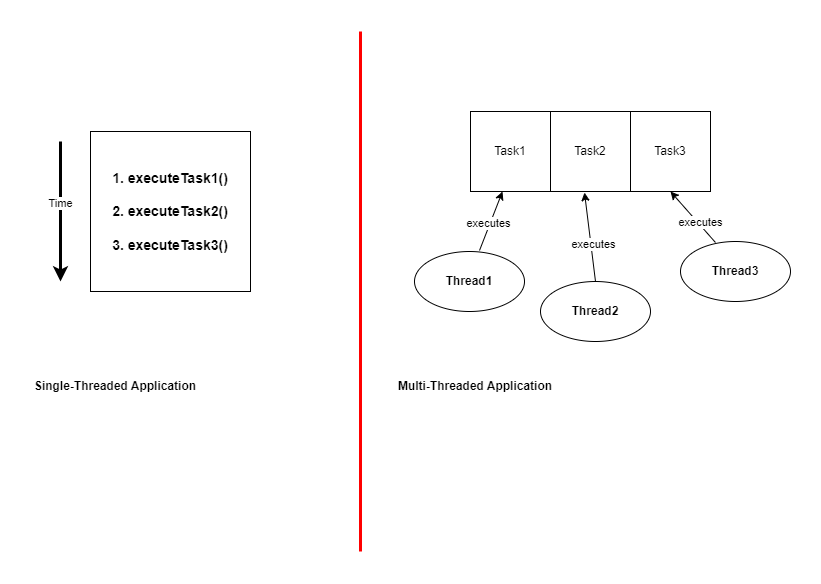
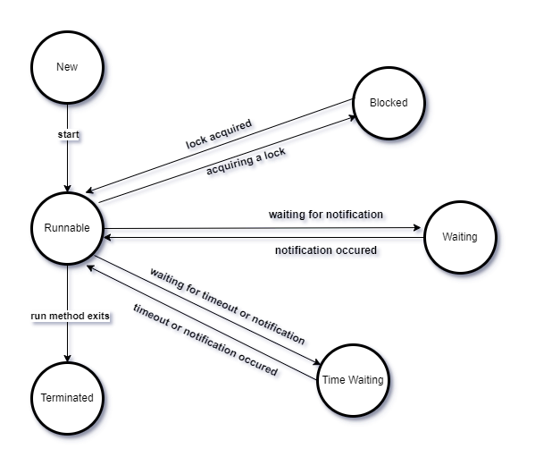
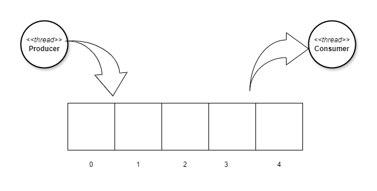

# Thread
- Program used to work sequentially
- Thread introduced the concept of multitasking in programming
- Program with multiple threads behave as executing multiple tasks at a same time.
- The capacity of program to run more than one thread is called **Multithreading**.
- Each task executes in a thread.

## Single VS Multi threaded

## Thread state

## Producer Consumer pattern

